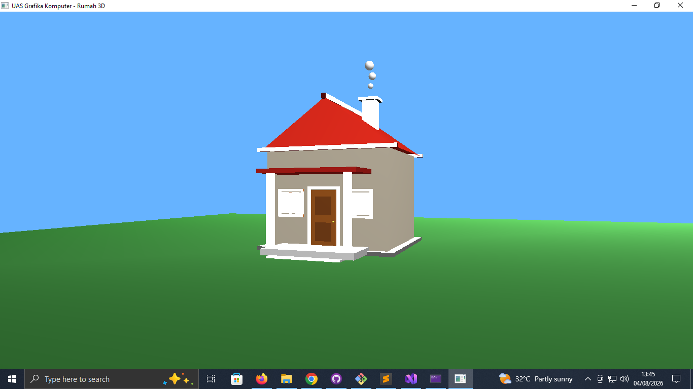
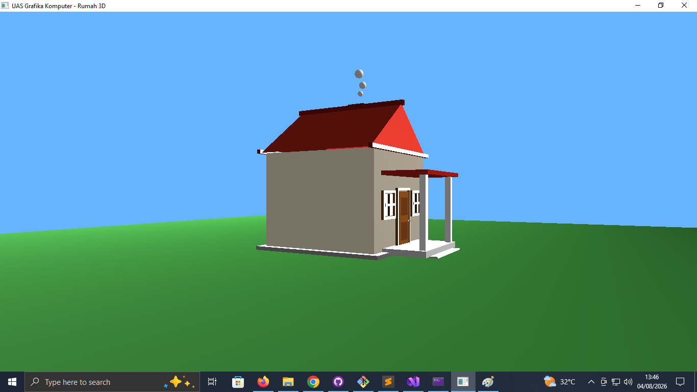
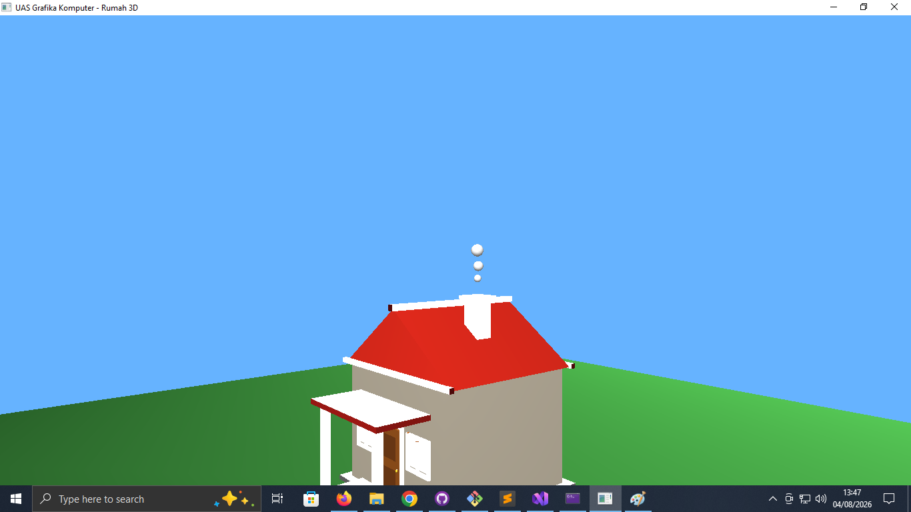
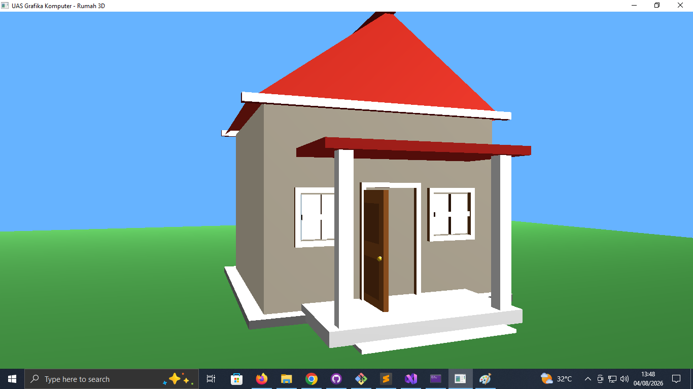
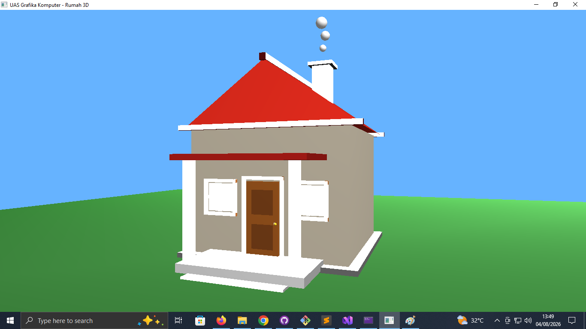
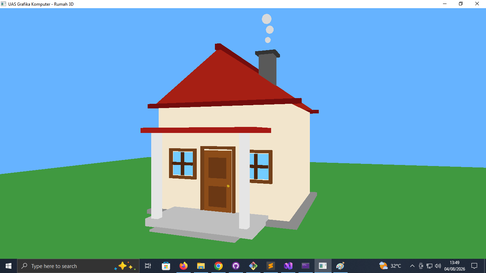

# 🏠 UAS Grafika Komputer - Rumah 3D OpenGL

Proyek UAS Mata Kuliah **Grafika Komputer** yang dibuat menggunakan **C++**, **OpenGL**, dan **FreeGLUT**. Program ini menampilkan sebuah rumah 3D lengkap dengan objek pendukung serta fitur interaktif seperti kontrol kamera, pencahayaan, dan animasi pintu.

---

## 📸 Tampilan Program

### Tampilan Depan


### Tampilan Samping


### Tampilan Atas


### Pintu Terbuka


### Lighting ON


### Lighting OFF


---

## ✨ Fitur

- Rumah 3D menggunakan OpenGL
- Atap rumah
- Pintu dapat dibuka dan ditutup
- Jendela dengan bingkai
- Pondasi rumah
- Teras dan tangga
- Cerobong asap
- Ground (tanah)
- Kamera interaktif
- Zoom In / Zoom Out
- Lighting ON / OFF

---

## 🎮 Kontrol

| Tombol | Fungsi |
|---------|--------|
| **A** | Putar kamera ke kiri |
| **D** | Putar kamera ke kanan |
| **W** | Kamera naik |
| **S** | Kamera turun |
| **Q** | Zoom In |
| **E** | Zoom Out |
| **O** | Membuka pintu |
| **P** | Menutup pintu |
| **L** | Mengaktifkan / Menonaktifkan Lighting |
| **ESC** | Keluar dari aplikasi |

---

## 🛠️ Teknologi

- C++
- OpenGL
- FreeGLUT
- Visual Studio 2022

---

## 📁 Struktur Proyek

```text
UAS-Grafika-Komputer/
│
├── assets/
├── dependencies/
│   └── freeglut/
│
├── UAS_OpenGL/
│   ├── main.cpp
│   ├── camera.cpp
│   ├── camera.h
│   ├── house.cpp
│   ├── house.h
│   ├── render.cpp
│   ├── render.h
│   └── UAS_OpenGL.vcxproj
│
├── .gitignore
├── README.md
└── UAS_OpenGL.slnx
```

---

## 🚀 Cara Menjalankan

1. Clone repository.

```bash
git clone https://github.com/aLR046/UAS-Grafika-Komputer.git
```

2. Buka file:

```
UAS_OpenGL.slnx
```

menggunakan Visual Studio.

3. Build dan jalankan project.

---

## 📄 Lisensi

Repository ini dibuat untuk keperluan **UAS Mata Kuliah Grafika Komputer**.
